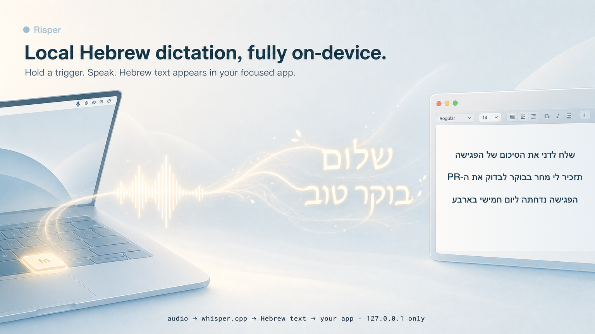

# Risper

Local-first Hebrew dictation for macOS.

Risper is a tiny menu bar app that lets you hold a global trigger, speak Hebrew,
release, and insert the transcript into the app you were already typing in. The
MVP runs speech recognition locally with `whisper.cpp`; there is no cloud ASR
path and no transcript upload path.



## Install For Non-Developers

Use this path for manual internal pilots. You do not need Xcode, Homebrew, the
source repo, a separate `whisper.cpp` build, or a separate model download.

1. Open `dist/Risper-internal-offline-arm64.dmg`.
2. Drag `Risper.app` to Applications.
3. Launch `/Applications/Risper.app`.
4. If macOS blocks first launch, right-click `Risper.app`, choose `Open`, and confirm.
5. Grant Microphone permission when prompted.
6. Grant Accessibility permission in System Settings > Privacy & Security > Accessibility.
7. Quit and relaunch Risper after granting Accessibility permission.

The internal DMG bundles `Risper.app`, `whisper-server`, the required
`whisper.cpp` dylibs, and the Ivrit.ai Hebrew model. It is locally signed for
pilot testing, but it is not Developer ID-signed or notarized. A first-launch
Gatekeeper override is expected until a Developer ID distribution path is added.

## What It Does

- Records only while you hold the dictation trigger.
- Converts microphone input to a local 16 kHz mono WAV.
- Sends the audio to a local `whisper.cpp` server on `127.0.0.1:8178`.
- Forces Hebrew transcription instead of language auto-detection or translation.
- Inserts the cleaned transcript into the focused app with a temporary paste.
- Restores your clipboard after insertion whenever the pasteboard is unchanged.

Risper now has an internal offline DMG for pilot installs. Internal testers can
install the app without the source repo, Xcode, Homebrew, or local build tools.
Developer tools are still required only on the machine that builds the app or
creates a new DMG.

## Prerequisites

For internal testers installing the offline DMG:

- Apple Silicon Mac.
- macOS 26 or newer.
- Ability to grant Microphone and Accessibility permissions in macOS System Settings.

The internal offline DMG bundles `Risper.app`, `whisper-server`, the required
`whisper.cpp` dylibs, and the Ivrit.ai Hebrew model. Testers do not need Xcode,
Homebrew, `cmake`, `ffmpeg`, `jq`, the source checkout, or a separate model
download.

For developers building from source or creating a new internal DMG:

- Apple Silicon Mac.
- macOS 26 or newer. The Swift package currently targets macOS 26.0.
- Full Xcode or Swift toolchain available from the command line.
- Homebrew for `cmake`, `ffmpeg`, and `jq`.
- A local `whisper.cpp` build with `whisper-server`.
- The Ivrit.ai `whisper-large-v3-turbo-ggml` model file.

Install the common command-line tools:

```bash
brew install cmake ffmpeg jq
```

`lsof`, `say`, `codesign`, and `security` are provided by macOS.

## Local ASR Setup

This section is only needed for developers building from source or creating a
new internal DMG. The internal offline DMG already includes the ASR runtime and
model.

Risper looks for `whisper-server` in the bundled app resources, in
`third_party/whisper.cpp/build/bin/whisper-server`, or in the path supplied by
`RISPER_WHISPER_SERVER`.

Build `whisper.cpp` locally:

```bash
mkdir -p third_party
git clone https://github.com/ggml-org/whisper.cpp.git third_party/whisper.cpp
cmake -S third_party/whisper.cpp -B third_party/whisper.cpp/build -DGGML_METAL=ON
cmake --build third_party/whisper.cpp/build --config Release -j
```

Download the Hebrew model to the default app support path:

```bash
mkdir -p "$HOME/Library/Application Support/Risper/Models/ivrit-large-v3-turbo"
curl -L \
  -o "$HOME/Library/Application Support/Risper/Models/ivrit-large-v3-turbo/ggml-model.bin" \
  "https://huggingface.co/ivrit-ai/whisper-large-v3-turbo-ggml/resolve/main/ggml-model.bin"
```

The model is large, so the initial download can take a while. After setup,
normal dictation runs locally and can work offline.

## Build And Run From Source

Use this path for development. Internal testers should install from the DMG
instead.

Build the Swift package:

```bash
swift build
```

For local development, create a stable local code-signing identity first. This
helps macOS keep Accessibility trust across rebuilds:

```bash
script/setup_local_codesign.sh
```

Build, stage, sign, and launch the app bundle:

```bash
script/build_and_run.sh
```

Verify that the app launches:

```bash
script/build_and_run.sh --verify
```

The staged app is written to `dist/Risper.app`.

## Package Internal DMG

Create a stable local code-signing identity before packaging. This helps macOS
keep Accessibility trust more stable across internal builds:

```bash
script/setup_local_codesign.sh
```

Build the release app, bundle the local ASR runtime and model, sign the app, and
create the offline DMG:

```bash
script/package_internal.sh
```

The package is written to:

```text
dist/Risper-internal-offline-arm64.dmg
```

The packaging machine must have the local `whisper.cpp` build and Ivrit.ai model
available. Machines that install from the DMG do not.

## Permissions

Risper needs two macOS permissions:

- Microphone: required to record dictation audio.
- Accessibility: required for the `fn` long-press monitor and for synthetic
  `Cmd+V` insertion into the focused app.

Open the Risper menu bar item and use:

- `Request Microphone Permission`
- `Open Privacy Settings`
- `Recheck Status`

After granting Accessibility permission, relaunch Risper so macOS applies the
new trust state.

## How To Use

1. Launch Risper and confirm the menu bar item says the model and ASR server are ready.
2. Focus a text field in any target app.
3. Hold `fn` until the recording overlay appears.
4. Speak Hebrew.
5. Release `fn`.
6. Wait for the transcript to be inserted at the original cursor.

If `fn` monitoring is unavailable, use the fallback shortcut:

```text
Control + Option + Space
```

The menu bar item also includes:

- `Copy Last Transcript`
- `Restart ASR Server`
- `Recheck Status`
- current model, permission, trigger, recording, and ASR state

## Verify Transcription

Run the ASR harness to generate a short Hebrew audio fixture, start or reuse the
local server, post the WAV to `/inference`, and validate the returned transcript:

```bash
script/asr_harness.sh
```

Useful environment overrides:

```bash
RISPER_ASR_PORT=8178
RISPER_MODEL_PATH="$HOME/Library/Application Support/Risper/Models/ivrit-large-v3-turbo/ggml-model.bin"
RISPER_WHISPER_SERVER="$PWD/third_party/whisper.cpp/build/bin/whisper-server"
RISPER_KEEP_SERVER=1
```

## Troubleshooting

If the menu says `Model: Missing`, confirm the model exists at:

```text
~/Library/Application Support/Risper/Models/ivrit-large-v3-turbo/ggml-model.bin
```

If the menu says `ASR: Missing whisper-server` after installing the internal
DMG, reinstall from the latest DMG or rebuild the package. If running from
source, build `whisper.cpp` or set `RISPER_WHISPER_SERVER` to an executable
`whisper-server` path.

If `fn Long-Press` says Accessibility is required, grant Accessibility permission
to `/Applications/Risper.app` for DMG installs or to the staged `dist/Risper.app`
for source-built runs. Then quit and relaunch Risper.

If dictation records but nothing appears in the target app, check Accessibility
permission and try a simple target such as TextEdit first.

For runtime logs from the installed app:

```bash
/usr/bin/log stream --info --style compact --predicate 'subsystem == "com.risper.Risper"'
```

For source-built development logs:

```bash
script/build_and_run.sh --telemetry
```

For permission-specific debugging, see
[`docs/debugging-macos-permissions.md`](docs/debugging-macos-permissions.md).

## Privacy Model

- Runtime ASR is local-only.
- The app talks to `whisper-server` over `127.0.0.1`.
- Audio recordings are temporary and live under
  `~/Library/Caches/Risper/recordings/`.
- Transcript text is not logged by default.
- The clipboard is used temporarily for insertion and restored afterward when
  Risper still owns the temporary pasteboard contents.

Do not add cloud transcription, telemetry, or transcript upload behavior unless
the product direction explicitly changes.

## Project Layout

```text
Sources/Risper/App             menu bar lifecycle and recording overlay
Sources/Risper/Recording       AVFoundation audio capture and WAV output
Sources/Risper/Transcription   local ASR server management and client
Sources/Risper/Triggers        fn long-press and fallback hotkey monitors
Sources/Risper/Injection       pasteboard-preserving text insertion
Sources/Risper/Permissions     Microphone and Accessibility status helpers
script/                        build, launch, packaging, and ASR harness scripts
docs/                          debugging and product notes
Resources/                     app icon resources
```

## Current Scope

The MVP intentionally stays narrow:

- Hebrew dictation only.
- Local `whisper.cpp` only.
- Menu bar status UI only.
- No transcript editor.
- No cloud fallback.
- No updater.
- Internal offline DMG only; no public notarized installer yet.

See [`specs.md`](specs.md) for the product and architecture source of truth.
